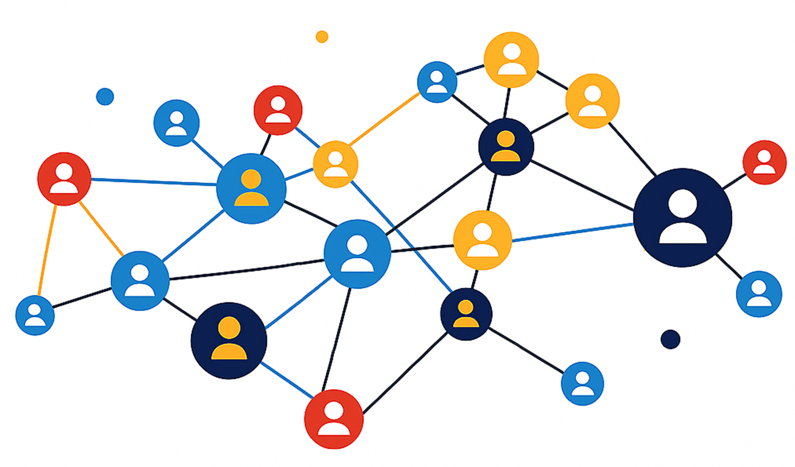

## What is a network? (Logo) {.smaller}

{fig-align="center" width="405"}

- **Nodes (vertices):** Actors or other entities.
- **Edges (ties):** Connections between nodes.
- **Degree:** Number of ties attached to a node.

## A network as a still figure

```{r}
#| include: false # hide code but still run
library(igraph)
library(igraphdata)
library(visNetwork)
library(DT)

# load karate club data from igraph
data("karate", package = "igraphdata")

# store data as object
g <- karate
```

**Zachary's karate club study** [@zachary1977] A social network that represents the social relationships among 34 karate club members. It shows how the club divided into two factions (between the Instructor Mr Hi and the administrator John A) following an internal conflict among the members. It consists of 34 nodes and 78 edges

```{r}
# Labeled and cached R code
#| Label: Karate club network
#| cache: true   
#| echo: false
#| fig-width: 30
#| fig-height: 30
#| fig-align: center

# store layout of network using igraph
positions <- igraph::layout_with_fr(g)

# Colors corresponding to the two factions
faction_colors <- c("#62B6FF", "#F3A35C")

# Plot network using igraph()
plot(
  g,
  layout = positions,
  vertex.size = 5 + 1.5 * igraph::degree(g),
  vertex.label = NA,
  vertex.color = faction_colors[igraph::V(g)$Faction],
  vertex.frame.color = "#1E4F80",
  edge.color = grDevices::adjustcolor("#7691AB", alpha.f = 0.5),
  edge.width = 1.2,
  margin = 0.03
)

# legend identifying the two factions in the network figure.
legend("topleft",
  legend = c("Mr. Hi", "John A."),
  fill = faction_colors,
  border = "#1E4F80",
  bty = "n",         # Remove legend border.
  cex = 0.9,         # Adjust legend text size.
  inset = 0.02       # Distance from plot boundaries.
)
```

## An interactive network

Click on a node or use Select by ID to highlight an actor in the network and their direct connections. Hover over a node to view its degree (number of connections), drag nodes to rearrange the network, and scroll to zoom in or out. Click on empty space to reset the selection.

```{r}
#| label: interactive-karate-network
#| echo: false

# Extract the edge list and calculate node degrees.
ends <- igraph::as_edgelist(g, names = FALSE)
deg <- igraph::degree(g)

# Create the node data frame.
nodes <- data.frame(
  id = seq_len(igraph::vcount(g)),
  label = as.character(igraph::V(g)$name),
  value = as.numeric(deg),
  title = paste("Degree:", deg)
)

# Create the edge data frame.
edges <- data.frame(
  from = as.integer(ends[, 1]),
  to = as.integer(ends[, 2])
)

# Generate the interactive network visualization.
net <- visNetwork::visNetwork(
  nodes, edges,
  width = "100%",
  height = "550px"
) |>
  
  # Configure node appearance and size.
  visNetwork::visNodes(
    shape = "dot",
    scaling = list(
      min = 25,
      max = 45
    ),
    color = list(
      background = "#438DDE",
      border = "#1E4F80",
      highlight = list(
        background = "#F3A35C",
        border = "#E67E22"
      )
    )
  ) |>
  
  # Configure edge appearance.
  visNetwork::visEdges(
    width = 0.7,
    hoverWidth = 0,
    color = list(
      color = "#A5B6C8",
      highlight = "#F3A35C"
    ),
    smooth = FALSE
  ) |>
  
  # Highlight the selected node and all direct neighbors.
  visNetwork::visOptions(
    highlightNearest = list(
      enabled = TRUE,
      degree = 1,
      algorithm = "all",
      hover = FALSE,
      labelOnly = FALSE,
      hideColor = "rgba(200,200,200,0.15)"
    ),
    nodesIdSelection = list(
      enabled = TRUE,
      useLabels = TRUE
    )
  ) |>
  
  # Set reproducible layout initialization.
  visNetwork::visLayout(
    randomSeed = 123
  ) |>
  
  # Configure interaction behavior.
  visNetwork::visInteraction(
    hover = TRUE,
    hoverConnectedEdges = FALSE,
    tooltipDelay = 300,
    selectable = TRUE,
    selectConnectedEdges = TRUE,
    dragView = FALSE,
    dragNodes = TRUE,
    zoomView = TRUE
  ) |>
  
  # Stabilize the network layout.
  visNetwork::visPhysics(
    stabilization = TRUE
  ) |>
  
  # Display the selected actor and degree inside the network.
  htmlwidgets::onRender("
    function(el, x) {

      // Retrieve the network instance.
      const graph = document.getElementById('graph' + el.id);
      if (!graph || !graph.chart) return;

      const network = graph.chart;

      // Position the information box inside the graph.
      graph.style.position = 'relative';

      const info = document.createElement('div');

      info.style.cssText = [
        'position:absolute',
        'top:12px',
        'right:12px',
        'z-index:20',
        'background:rgba(255,255,255,0.95)',
        'padding:8px 14px',
        'border-radius:6px',
        'font:16px Arial,sans-serif',
        'color:#1E4F80',
        'pointer-events:none'
      ].join(';');

      info.textContent = 'Select an actor';
      graph.appendChild(info);

      // Retrieve degree information for the selected node.
      function showDegree(id) {

        if (id === null || id === undefined || id === '') {
          info.textContent = 'Select an actor';
          return;
        }

        const node = network.body.data.nodes.get(Number(id));

        if (node) {
          info.textContent =
            'Actor ' + node.id + ' | Degree: ' + node.value;
        }
      }

      // Update the information box when clicking a node.
      network.on('click', function(params) {
        if (params.nodes.length > 0) {
          showDegree(params.nodes[0]);
        } else {
          showDegree(null);
        }
      });

      // Update the information box when using Select by ID.
      const selector =
        document.getElementById('nodeSelect' + el.id);

      if (selector) {
        selector.addEventListener('change', function() {
          showDegree(this.value);
        });
      }
    }
  ")

# Display the interactive network in the Quarto slide.
htmlwidgets::saveWidget(
  net,
  file = "karate-network.html",
  selfcontained = FALSE
)
```

<iframe src="karate-network.html" style="width:100%; height:550px; border:none;">

</iframe>

## Who is best connected? (centrality measures)

Each row represents a karate club member. Degree indicates the number of direct connections, while betweenness measures how frequently an actor lies on the shortest paths between others, indicating their potential role as a bridge.The table is interactive, you can sort columns, search for actors, and navigate pages.

```{r}
#| label: network statistics table
#| echo: false

# Calculate degree and betweenness centrality for each actor.
node_statistics <- data.frame(
  Actor = igraph::V(g)$name, 
  Degree = as.integer(igraph::degree(g)),
  Betweenness = round(igraph::betweenness(g, directed = FALSE), 1)
)

# Sort actors by degree (highest first), then by betweenness.
node_statistics <- node_statistics[
  order(-node_statistics$Degree, -node_statistics$Betweenness),
]

# Create an interactive table of network statistics.
DT::datatable(
  node_statistics,
  rownames = FALSE,              # Hide row numbers.
  options = list(
    pageLength = 7,              # Display 7 actors per page.
    lengthChange = FALSE,        # Disable changing the number of rows.
    searching = TRUE,            # Enable searching for actors.
    ordering = TRUE,             # Enable sorting by column.
    scrollX = TRUE,              # Allow horizontal scrolling.
    dom = "ftip"                 # Display search, table, information, pagination.
  ),
  class = "stripe compact hover", # Apply table styling.
  width = "100%"
)
```

## Aligned multi-row equation: Average Degree Formula

The equation below illustrates how to calculate the average degree (the average number of connections per node) in an undirected network by dividing twice the total number of edges by the number of nodes. [@hao2025]

$$\begin{aligned}
\bar{k} &= \frac{1}{N}\sum_{i=1}^{N} k_i \\[10pt]
        &= \frac{1}{N}\sum_{i=1}^{N}\sum_{j=1}^{N} A_{ij} \\[10pt]
        &= \frac{2|E|}{N}
\end{aligned}$$

Where:

- $N$: Total number of nodes (actors).

- $k_i$: Number of connections of node $i$.

- $A_{ij}$: Adjacency matrix, equal to 1 if nodes $i$ and $j$ are connected, and 0 otherwise.

- $|E|$: Total number of edges.

- $i,j$: Indices identifying individual nodes in the network.

The following R code demonstrates how to calculate the average degree of Zachary's Karate Club Network in R using the `igraph` package

```{r}
#| label: average degree example
#| echo: true 
#| eval: false # command to show R code but not run

# Load network data. 
data("karate", package = "igraphdata") 

# Store dataset into object
g <- karate  

# Calculate average degree. 
average_degree <- mean(igraph::degree(g))  

# Display the result. 
print(average_degree) 
```

## References 
